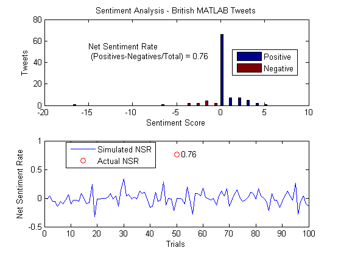
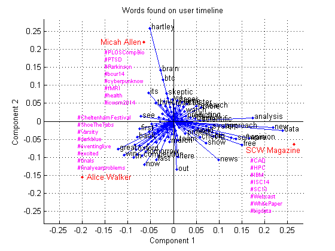
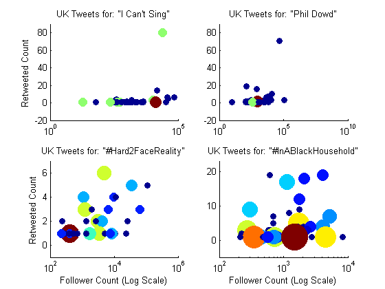
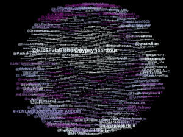
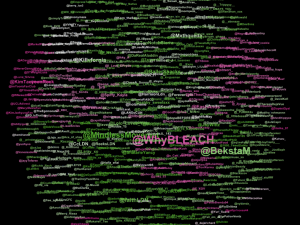

Analyzing Twitter with MATLAB
=============================
Whatever your opinion of social media these days, there is no denying it is now an integral part of our digital life.
Twitter is a good starting point for social media analysis because people openly share their opinions to general public. This is very different from Facebook where social interactions are often private.

I will share some sample analyses first, then show you how to use MATLAB to retrieve tweets from Twitter API.

Were They Happy or Unhappy - Sentiment Analysis
-----------------------------------------------
As an example, I collected and processed 100 tweets that contain `matlab` from UK. One of the common analyses you can perform on a large number of tweets is sentiment analysis. Sentiment is scored based on the words contained in a tweet.



The sentiment distribution is largely neutral to positive but there are some very strong negative tweets. Typically people use *Net Sentiment Rate (NSR)* to track the sentiments.

    NSR = (Positive Tweets-Negative Tweets)/Total Tweets 
    
How good was our NSR for this example? If you have completely symmetric distribution, the positives and negatives will cancel out and you get just the neutrals. The subplot shows the result of this simulation, and the simulated NSR was just slightly above 0. So our actual NSR, 0.76, looks pretty good.

How well did sentiment analysis actually work? The language in some negative tweets is a bit too strong to share, but I will share some positives as well as some negatives with tamer language here.

    Top 5 by Sentiment Score
        '@healiocentric Ah I see. Well, Matlab is awesome for plotting like that so if you need a cool p...'
        '@hookes2 Ah well that's life :(  I'm having fun spending my time playing around with Matlab - t...'
        '@iamreddave That's an interesting combination. I don't know much about R (only Matlab). Was it ...'
        '@naufilbhatti what lol? Eating like a pig? Its used as a phrase. Iska ye matlab nai k waqai ais...'
        'Hey you know what I love doing in Matlab?  DOCUMENTATION!  woooo  /sarcasm'
        
    Tamer Bottom 5 by Sentiment Score
        '@CSIchick89 Hello! So pleased you've made it on to twitter. I've lost track of all the MatLab c...'
        'Matlab license server down at Leeds?! This is the worst.'
        'Tried to look at Matlab today. It hurt my brain too much so it can wait 'til Monday.'
        'Mixed two questions into 1 into MATLAB ensures major fail. My graph doesn't look correct -_-'
        'just discovered #matlab script is giving  wrong output...2 months after writing and 2 months af...'
        
This is a text classification similar to spam filtering, so you could use [Naive Bayes](http://www.mathworks.com/help/stats/naive-bayes-classification.html) to build your own scoring dictionary.

What People Tweet About - Tweet Content Visualization
-----------------------------------------------------
Among those who tweeted about MATLAB, what else do they talk about in their tweets? In particular, I am interested in users with large number of followers as this indicates they are probably active, influential users who tweet about interesting things. Micah in particular has an impressive number of followers for an individual.

    Top 5 Users by follower count
               Name             Followers
       _____________________    _________
       'Micah Allen'            10562
       'moneyscience'            5456
       'SCW Magazine'            1637
       'Bristol Uni IT news'      788
       'Alice Walker'             628

Here is the plot of words in user timelines from Micah, SCW Magazine and Alice using [PCA](http://www.mathworks.com/help/stats/pca.html) (since we can guess that moneyscience is about computational finance and Bristol Uni IT news is probably a newsletter RSS feed).



* Micah probably studies mental disorder from neuroscience perspective, based on `#fMIR`,`brain` and mentions of neurological disorders - apparently a hot topic.
* SCW Magazine looks like a publication about HPC and Big Data. Another hot topic.
* Alice is probably a graduate student in her final year who tweets about her personal musings.

I only ran this analysis for three users, but you could use this technique to discover groupings of Twitter users with [clustering](http://www.mathworks.com/machine-learning).

Does Follower Count Really Matter? Going Viral on Twitter
----------------------------------------------------------
If you have a large number of followers, you are considered more influential because more people will see your tweets. To test this assumption I need larger dataset. So I collected new batch of data - 1000 tweets from 4 trending topics from UK, and plotted the users based on their follower counts vs. how often their tweets got retweeted. The size (and the color) of the bubbles show how often those users tweeted.



It looks like you do need a some base number of followers to make it to the national level, but the correlation between the follower count to the frequency of getting retweeted looks weak. Those charts look like different stages of viral diffusion - the top two charts clearly show one user broke away from the rest of the crowd, and in that process they may have also gained more followers. The bottom two charts show a number of users competing for attention but no one has clear breakout yet. If this was an animation it may look like boiling water. Is anyone interested in analyzing whether this is indeed how a tweet goes viral?

Visualizing the Retweet Social Graph
------------------------------------
Retweeting of one user's tweet by others creates network of relationship that can be represented as a social graph. We can visualize such relationship with a popular social networking analysis tool [Gephi](https://gephi.org/).

"I Can't Sing" Social Graph



"#InABlackHousehold" Social Graph



You can see that in the first case two users formed large clusters of people retweeting their tweets, and everyone else was dwarfed. In the second case, we also see two dominant users but they have not yet formed a large scale cluster.

Getting Started with Twitter using Twitty
------------------------------------------
Now that you have seen the analyses I did with Twitter, it is time to share how I did it in MATLAB. To get started with Twitter, you need to get your developer credentials. You also need Twitty by Vladimir Bondarenko. It is simple to use and comes with excellent documentation.

_**Note**: A couple of people reported that they ran into problems with Twitter credentials using older version of MATLAB. If you don't have access to R2014a version of MATLAB with which my code was based on, you can get a personal use license [MATLAB Home](https://www.mathworks.com/products/matlab-home/) at a substantially reduced price._

1. Create a [Twitter  account](https://twitter.com/) if you do not already have one.
2. Create a  [Twitter app](https://apps.twitter.com/) to obtain developer credentials
3. Download and install [Twitty](http://www.mathworks.com/matlabcentral/fileexchange/34837-twitty) from FileExchange, along with [JSON Parser](http://www.mathworks.com/matlabcentral/fileexchange/20565-json-parser) and optionally [JSONLab](http://www.mathworks.com/matlabcentral/fileexchange/33381-jsonlab--a-toolbox-to-encode-decode-json-files-in-matlab-octave)
4. Create a structure array to store your credentials for Twitty.

Let's start by searching for tweets that mention `matlab`.

```
% a sample strucutre array to store the credentials
creds = struct('ConsumerKey','your-consumer-key-here',...
	'ConsumerSecret','your-consumer-secret-here',...
	'AccessToken','your-token-here',...
	'AccessTokenSecret','your-token-secret-here');
	
% set up a twitty object
addpath twitty_1.1.1; % Twitty
addpath parse_json; % Twitty's default json parser
addpath jsonlab; % I prefer JSONlab, however.
load('creds.mat') % load my real credentials
tw = twitty(creds); % instantiate a Twitty object
tw.jsonParser = @loadjson; % specify JSONlab as json parser

% search for English tweets that mention 'matlab'
S = tw.search('matlab','lang','en');
% get more tweets if the cursor to the next result is available
count = length(S{1}.statuses);
while isfield(S{1}.search_metadata,'next_results')
	S = tw.search(S{1}.search_metadata.next_results);
	count = count + length(S{1}.statuses);
end
fprintf('Tweets retrieved: %d\n\n',count)
```
    
> Tweets retrieved: 15

Twitter Search API for Recent Tweets
------------------------------------
This simple example shows you a number of issues. First, we only got 15 tweets. 15 is the default of this API, but you can override it by specifying count parameter, but the max is 100 tweets.
Another issue is a word can mean different thing in different countries.

> Domino's Pizza India
>
>     'Keep calm and do OLO. OLO matlab OnLineOrdering. Order now...'

Why would Domino's Pizza India tweet about MATLAB? Actually, `matlab` is a common Hindi word. 'OLO *matlab* OnLineOrdering' translates to 'OLO *means* OnLineOrdering'.
One way to deal with this issue is to limit the geography in search. You can set the geography by specifying the latitude and longitude of a point and draw a circle around it with specific radius. Geocode is defined as latitude,longitude,radius.

* Continental US: `39.8,-95.583068847656,1600mi`;
* Great Britain:  `53.81982,-2.406348,300mi`;

Finally, we also want to obtain hashtags, URLs and other special entities in tweets. To have those entities provided in the result, you set `include_entities` to `true`.
The revised API call should look like:

```
GB_tweets = tw.search('matlab','count',100,'include_entities','true','lang','en','geocode','53.81982,-2.406348,300mi');
```

Processing Tweets and Scoring Sentiments
----------------------------------------
Twitty stores tweets in structure array created from API response in JSON format. I prefer using [table data type](http://www.mathworks.com/help/matlab/tables.html) when it comes to working with heterogeneous data that contain a mix of numbers and text. I wrote a ulitity class `processTweets` to convert structure arrays into tables and compute sentiment scores using [object oriented programming](http://www.mathworks.com/discovery/object-oriented-programming.html), another favorite feature I use a lot.
For sentiment analysis. I used [AFINN](http://finnaarupnielsen.wordpress.com/2011/03/16/afinn-a-new-word-list-for-sentiment-analysis/comment-page-1/#comment-445), along with a [list of English stop words](http://www.textfixer.com/resources/common-english-words.txt) so that we don't count frequent common words like "a" or "the".

```
% reload the previously saved search result from Great Britain
load('tweets2.mat')

% process the structure array with a utility method |extract|
[users,tweets] = processTweets.extract(S);

% sort users by follower count
[~,topUsers] = sortrows(users,'Followers','descend');

% remove commercial and Hindi users
topUsers(users.isCommercial(topUsers) | users.isHindi(topUsers)) = [];

% compute the sentiment scores with |scoreSentiment|
scoreFile = 'AFINN/AFINN-111.txt';
stopwordsURL ='http://www.textfixer.com/resources/common-english-words.txt';
sentiments= processTweets.scoreSentiment(tweets,scoreFile,stopwordsURL);

% append the scores to |tweets| as a column
tweets.Sentiment = sentiments;

% calculate the net sentiment rate
netSent = (sum(sentiments>=0)-sum(sentiments<0))/length(sentiments);
	
% simulate nsr assuming the pos/neg tweets follow normal distribution
nsr = zeros(1,100);
for i = 1:100
	sim = std(sentiments).*randn(1,100);
	nsr(i) = (sum(sim>=0)-sum(sim<0))/length(sim);
end

% bin tweets by count
binranges = min(sentiments):max(sentiments);
bincounts = histc(sentiments,binranges);

% separate positives and negatives into separate columns
bincounts = repmat(bincounts,[1,2]);
bincounts(1:17,1) = 0;
bincounts(18:23,2) = 0;

% plot the sentiment histogram
figure
subplot(2,1,1)
bar(binranges,bincounts,'histc')
xlabel('Sentiment Score')
ylabel('Tweets')
legend('Positive','Negative','Location','Best')
title('Sentiment Analysis - British MATLAB Tweets')
text(-15,50,sprintf('Net Sentiment Rate \n (Positives-Negatives/Total) = %.2f',...
netSent))

% plot NSR simulation result
subplot(2,1,2)
plot(1:100,nsr)
hold on
plot(50,netSent,'ro')
xlabel('Trials')
ylabel('Net Sentiment Rate')
legend('Simulated NSR','Actual NSR','Location','Best')
text(52,netSent,num2str(netSent))
hold off
```

Twitter Content Visualization of User Timelines
-----------------------------------------------
Besides search, Twitty also supports `userTimeline` method that retrieves recent tweets from a specific user. You can retrieve up to 200 recent tweets with this API call.

```
S = tw.userTimeline('user_id',users.Id(topUsers(1)),'count',200);
```

Because I wanted to learn what the top five users tweet about who was identified earlier, I added a new method wordsInTimeline to retrieve their 200 recent tweets.

```
% make the user timeline call and process the tweets
[wordsInTimeline,dict,hashtagsInTimeline,mentionsInTimeline] =...
	processTweets.wordsInTimeline(tw,users.Id(topUsers(1:5)),stopwordsURL);

% reload the previously saved search result from top 5 users
load('timeline.mat')

% create a user x word matrix
userWordsMatrix = zeros(3,height(dict));
subset = [1,3,5];
for i = 1:3
	words = wordsInTimeline.Word(wordsInTimeline.User == subset(i));
	counts = wordsInTimeline.Count(wordsInTimeline.User == subset(i));
	[~,cols]=ismember(words,dict.Word);
	counts(cols==0) = [];
	cols(cols==0) = [];
	userWordsMatrix(i,cols) = counts;
end

% run PCA
[coeff,score,~] = pca(userWordsMatrix);

% use the most significant words that distinguish those users
keep = [112,157,229,253,308,358,381,467,520,565,726,1158,1203,1312,...
	1357,1391,1607,1682,1685,1840,1956,2027,2025,2062,2102,2125,2139,...
	2157,2317,2371,2454,2527,2631,2643,2709,2750,2778,2981,3002,3024,...
	3044,3089,3264,3271,3306,3352,3387];
dictWords = dict.Word;
dictWords(setdiff(1:height(dict),keep)) = {''};

% plot the words by the first two principal components
figure
biplot(coeff(:,1:2),'scores',score(:,1:2),'VarLabels',dictWords)
title('Words found on user timeline')

% add user names
text(-0.16,0.22,users.Name{topUsers(subset(1))},'Color','r')
text(0.16,-0.08,users.Name{topUsers(subset(2))},'Color','r')
text(-0.19,-0.156,users.Name{topUsers(subset(3))},'Color','r')

% add hashtags for each user

% Micah
hashtags = hashtagsInTimeline.Hashtag(hashtagsInTimeline.User==subset(1));
string = sprintf('#%s\n',hashtags{1:8});
text(-0.15,0.11,string,'Color','m','FontSize',7)

% SCW Magazine
hashtags = hashtagsInTimeline(hashtagsInTimeline.User==subset(2),:);
hashtags(hashtags.Count == 1,:) = [];
hashtags = hashtags.Hashtag;
string = sprintf('#%s\n',hashtags{[1:7 9]});
text(0.17,-0.19,string,'Color','m','FontSize',7)

% Alice
hashtags = hashtagsInTimeline(hashtagsInTimeline.User==subset(3),:);
hashtags(hashtags.Count <= 2,:) = [];
hashtags = hashtags.Hashtag;
string = sprintf('#%s\n',hashtags{1:8});
text(-0.21,-0.07,string,'Color','m','FontSize',7)
```

Streaming API for High Volume Real Time Tweets
----------------------------------------------
If you need more than 100 or 200 tweets to work with, then your only option is to use Streaming API which provides access to the sampled Twitter firehose in real time. That also means you need to access the tweets that are currently active. You typically start with a trending topic from a specific location.

You get local trends by specifying the geography with WOEID (Where On Earth ID), available at [WOEID Lookup](http://woeid.rosselliot.co.nz/).

```
uk_woeid = '23424975'; % UK
uk_trends = tw.trendsPlace(uk_woeid);
uk_trends = cellfun(@(x) x.name, uk_trends{1}.trends, 'UniformOutput',false)';
```
    
Once you have the current trends, you can use Streaming API to retrieve the tweets that mention the trending topic. When you specify an output function with Twitty, the data is store within Twitty object. Twitty will process incoming tweets up to the sample size specified, and process data by the batch size specified.

    tw.outFcn = @saveTweets; % output function
    tw.sampleSize = 1000;  % default 1000
    tw.batchSize = 1; % default 20
    tic;
    tw.filterStatuses('track',uk_trends{1}); % Streaming API call
    toc
    uk_trend_data = tw.data; % save the data
    
```
% reload the previously saved search result for 4 trending topics in UK
load('uk_data.mat')


% plot
figure
for i = 1:4
	% proceess tweets
	[users,tweets] = processTweets.extract(uk_data(i).statuses);
	
	% get who are mentioned in retweets
	retweeted = tweets.Mentions(tweets.isRT);
	retweeted = retweeted(~cellfun('isempty',retweeted));
	[screen_names,~,idx] = unique(retweeted);
	count = accumarray(idx,1);
	retweeted = table(screen_names,count,'VariableNames',{'Screen_Name','Count'});
	
	% get the users who were mentioned in retweets
	match = ismember(users.Screen_Name,retweeted.Screen_Name);
	retweetedUsers = sortrows(users(match,:),'Screen_Name');
	match = ismember(retweeted.Screen_Name,retweetedUsers.Screen_Name);
	retweetedUsers.Retweeted_Count = retweeted.Count(match);
	[~,order] = sortrows(retweetedUsers,'Retweeted_Count','descend');
	
	% plot each topic
	subplot(2,2,i)
	scatter(retweetedUsers.Followers(order),...
		retweetedUsers.Retweeted_Count(order),retweetedUsers.Freq(order)*50,...
		retweetedUsers.Freq(order),'fill')

	if ismember(i, [1,2])
		ylim([-20,90]); xpos = 2; ypos1 = 50; ypos2 = 40;
	elseif i == 3
		ylim([-1,7])
		xlabel('Follower Count (Log Scale)')
		xpos = 1010; ypos1 = 0; ypos2 = -1;
	else
		ylim([-5,23])
		xlabel('Follower Count (Log Scale)')
		xpos = 110; ypos1 = 20; ypos2 = 17;
	end
	
	% set x axis to log scale
	set(gca, 'XScale', 'log')
	
	if ismember(i, [1,3])
		ylabel('Retweeted Count')
	end
	title(sprintf('UK Tweets for: "%s"',uk_data(i).query.name))
end
```

Save an Edge List for Social Graph Visualization
------------------------------------------------
Gephi imports an edge list in CSV format. I added A new method `saveEdgeList` to `processTweet` that saves the screen names of the users as *source* and the hashtags and screen names they mention in their tweets as *target* in a [Gephi-ready CSV file](https://gephi.org/users/supported-graph-formats/csv-format/).

```
processTweets.saveEdgeList(uk_data(1).statuses,'edgeList.csv');
```
    
> File "edgeList.csv" was successfully saved.

Now it's your turn
------------------
Hopefully you see that it is very easy to work with Twitter data within MATLAB and got the taste of what kind of analyses are possible. We only scratched the surface. Twitter offers many of the most interesting opportunities for data analytics.
